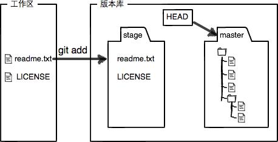

## Git学习笔记

* 创建版本库  
	`
	git init
	`
* 把文件添加到版本库  
	`
	git add readme.txt  
	`
* 提交文件到仓库  
	`
	git commit -m "wrote a readme file
	`
#### 总结
* 初始化一个Git仓库,使用git init命令
* 添加文件到Git仓库,分两步:
    第一步,使用`git add`(可反复多次使用,添加多个文件)
    第二步,使用`git commit`,完成
	
***
	
* 查看之前的修改  
`
git diff readme.txt
`
### 总结
* 要随时掌握工作区的状态，使用git status命令。
* 如果git status告诉你有文件被修改过，用git diff可以查看修改内容。

***

### 版本回退  
查看历史记录  
`git log`

格式化输出信息  
`git log --pretty=oneline`  

退回到上一个版本  
`git rest --hard HEAD^`
(在Git中HEAD表示当前版本,也就是最新的提交,上一个版本是HEAD^ 上上个版本是HEAD^^)  

指定退回到某个版本  
`git rest --hard 3628164` 3628164为版本号

Git的版本回退速度非常快，因为Git在内部有个指向当前版本的HEAD指针，当你回退版本的时候，Git仅仅是把HEAD从指向“append GPL”：
  

改为指向“add distributed”：  

显示每一次命令
`git reflog`  

### 总结
* HEAD指向的版本就是当前版本，因此，Git允许我们在版本的历史之间穿梭，使用命令git reset --hard commit_id。  
* 穿梭前，用git log可以查看提交历史，以便确定要回退到哪个版本。
* 要重返未来，用git reflog查看命令历史，以便确定要回到未来的哪个版本。

***

### 工作区和暂存区

####工作区（Working Directory）：就是你在电脑里能看到的目录，比如我的learngit文件夹就是一个工作区：
  
#### 版本库 （Repository）：工作区有一个隐藏目录“.git”，这个不算工作区，而是Git的版本库。

Git的版本库里存了很多东西，其中最重要的就是称为stage（或者叫index）的暂存区，还有Git为我们自动创建的第一个分支master，以及指向master的一个指针叫HEAD。  

  

##### 前面讲了我们把文件往Git版本库里添加的时候，是分两步执行的：

##### 第一步是用“git add”把文件添加进去，实际上就是把文件修改添加到暂存区；

##### 第二步是用“git commit”提交更改，实际上就是把暂存区的所有内容提交到当前分支。

##### 因为我们创建Git版本库时，Git自动为我们创建了唯一一个master分支，所以，现在，commit就是往master分支上提交更改。

##### 你可以简单理解为，需要提交的文件修改通通放到暂存区，然后，一次性提交暂存区的所有修改。

`Git is a distributed version control system. `  
`Git is free software distributed under the GPL.`  
`Git has a mutable index called stage.`  

##### 然后，在工作区新增一个LICENSE文本文件（内容随便写）。
##### 先用git status查看一下状态：
* git status
* On branch master
* Changes not staged for commit:
* (use "git add <file>..." to update what will be committed> )
* (use "git checkout -- <file>..." to discard changes in > working directory)
*    modified:   readme.txt

* Untracked files:
* (use "git add <file>..." to include in what will be committed)

*    LICENSE
* no changes added to commit (use "git add" and/or "git commit -a")

#####  Git非常清楚地告诉我们，readme.txt被修改了，而LICENSE还从来没有被添加过，所以它的状态是Untracked。

##### 现在，使用两次命令git add，把readme.txt和LICENSE都添加后，用git status再查看一下：
 
 
*  git status
* On branch master
* Changes to be committed:
*   (use "git reset HEAD <file>..." to unstage)
 
*       new file:   LICENSE
*       modified:   readme.txt

##### 现在，暂存区的状态就变成这样了：

### 总结
##### 暂存区是Git非常重要的概念，弄明白了暂存区，就弄明白了Git的很多操作到底干了什么。

***
### 管理修改
为什么Git比其他版本控制系统设计得优秀，因为Git跟踪并管理的是修改，而非文件。  

什么是修改？比如你新增了一行，这就是一个修改，删除了一行，也是一个修改，更改了某些字符，也是一个修改，删了一些又加了一些，也是一个修改，甚至创建一个新文件，也算一个修改。

##### Git管理的是修改，当你用“git add”命令后，在工作区的第一次修改被放入暂存区，准备提交，但是，在工作区的第二次修改并没有放入暂存区，所以，“git commit”只负责把暂存区的修改提交了，也就是第一次的修改被提交了，第二次的修改不会被提交。

### 总结
##### 理解了Git是如何跟踪修改的，每次修改，如果不add到暂存区，那就不会加入到commit中。
